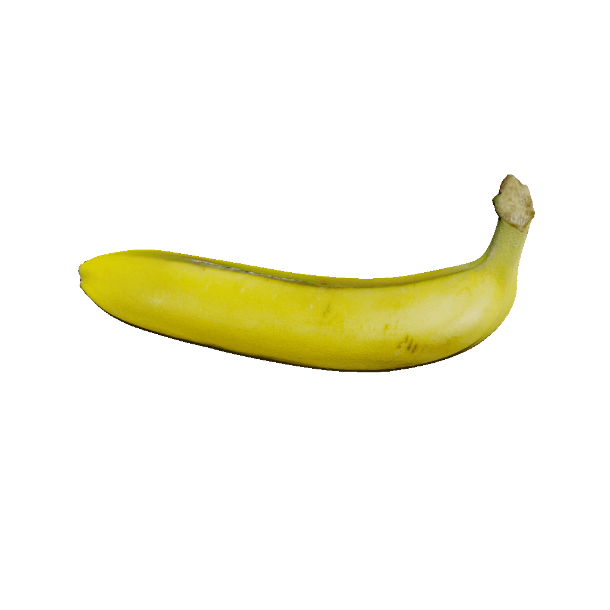
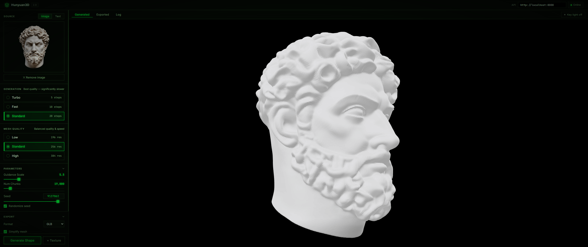

# Hunyuan3D Studio

A local Docker setup and web UI for running [Tencent's Hunyuan3D-2](https://github.com/Tencent/Hunyuan3D-2) as a self-hosted API + 3D generation studio.



## Overview

This project packages Hunyuan3D-2 into a ready-to-run Docker container and pairs it with a browser-based studio where you can:

- Generate 3D meshes from **images** or **text prompts**
- Choose generation speed (Turbo / Fast / Standard)
- Control mesh resolution (Low / Standard / High)
- Export as **GLB, OBJ, PLY, or STL**
- Optionally simplify mesh face count before downloading
- Preview results interactively in a built-in 3D viewer


## Demo
## 🎥 Live Demo

<p align="center">
  
</p>

<p align="center">
Real-time face detection and recognition streaming from the browser.
</p>


## Requirements

- Docker with NVIDIA GPU support (`nvidia-container-toolkit`)
- CUDA-capable GPU (Dockerfile targets CUDA 12.4 / sm_75+)
- ~20 GB disk space for model weights (downloaded automatically on first run)

## Getting Started

### 1. Build the Docker image

```bash
docker build -f .docker/server.dockerfile -t hunyuan3d .
```

> First build clones the Hunyuan3D-2 repo and compiles CUDA extensions — expect 15–30 minutes depending on your connection.

### 2. Start the API server

```bash
bash start.sh
```

This runs the container and exposes the API on `http://localhost:8000`.

To enable texture generation, uncomment the last line in `start.sh`:

```bash
bash -c "python api_server.py --host 0.0.0.0 --port 8000 --enable_tex"
```

> Texture generation requires significantly more VRAM.

### 3. Open the UI

Open `ui/index.html` directly in your browser (no server needed — it's plain HTML/JS).

The UI will connect to `http://localhost:8000` by default. You can change the API URL in the top bar.

## UI Features

| Feature | Details |
|---|---|
| **Source** | Upload an image or type a text prompt |
| **Generation modes** | Turbo (5 steps) · Fast (10 steps) · Standard (20 steps) |
| **Mesh quality** | Low (196 res) · Standard (256 res) · High (384 res) |
| **Parameters** | Guidance scale, num chunks, seed (with randomize option) |
| **Export** | GLB · OBJ · PLY · STL, with optional mesh simplification |
| **Viewer** | Interactive 3D preview with key light toggle |
| **Log** | Per-job report with parameters and elapsed time |

## Project Structure

```
├── .docker/
│   └── server.dockerfile   # CUDA image with Hunyuan3D-2
├── ui/
│   ├── index.html          # Web studio
│   ├── app.js              # Frontend logic
│   └── style.css           # UI styles
├── assets/
│   └── example_images/     # Sample input images
└── start.sh                # Docker run script
```

## Notes

- Model weights are cached in `~/.cache/huggingface` and reused across runs.
- The `--shm-size=8g` flag in `start.sh` is required for large mesh decoding.
- Text-to-3D (`--enable_t23d`) is a separate flag not yet wired into `start.sh`.

## Credits

Built on top of [Hunyuan3D-2](https://github.com/Tencent/Hunyuan3D-2) by Tencent.
